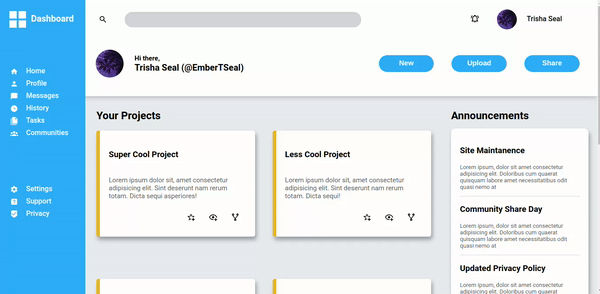

# Admin Dashboard

Table of Contents

1. [About The Project](#about-the-project) 
2. [Built With](#built-with)  
3. [Screenshots](#screenshots)  
3. [Contact](#contact)  
4. [Acknowledgements](#acknowledgements)

## About The Project

This is a static admin dashboard, developed to demonstrate the use of CSS Grid in full page layouts.   
Currently, this is NOT responsive, i.e it is intended to be viewed in large width screens only.

### Built With

## Screenshots

<a href="#top">Back to top</a>

## Contact

LinkedIn: [Trisha Seal](https://linkedin.com/in/trisha-seal)  
GitHub: [@EmberTSeal](https://github.com/EmberTSeal)

## Acknowledgements

Design provided by The Odin Project. Development by me, as part of The Odin Project, 2023.

<a href="#top">Back to top</a>

